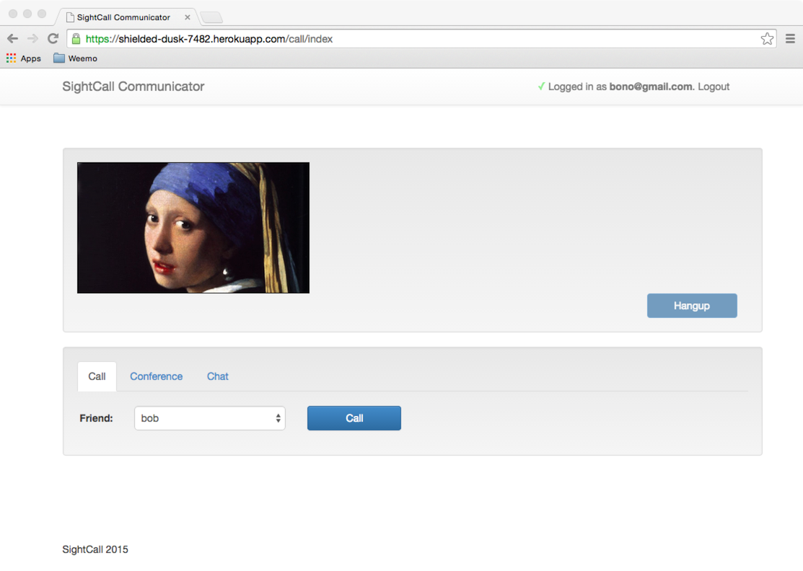

SightCall Communicator
======================

SightCall Communicator is a demonstration web application showcasing real-time communications for a small workgroup.
Communicator demonstrates three real-time services and shows how to implement them using the SightCall platform.

- one-to-one video and voice
- multiparty video-teleconference
- text-chat

SightCall Communicator has been created using common web technologies
(Rails, Bootstrap, jQuery), and is purposely kept small.  Not only is
it a showcase of SightCall technologies, it is a tutorial of
best-practices and idioms to use when embedding SightCall features
into your own site.

Communicator is easy to clone and run on your own servers, or you can
try it out by deploying on Heroku.  (Even a free/hobby account will
suffice.)  Read on.




## Run It On Heroku

You can run your own instance of SightCall Communicator on Heroku in
just a few minutes.

- Clone this repository so you can customize it.
- If you have not already, you must request an API KEY and credentials from SightCall.
  Get it here: [http://www.sightcall.com/developers/](http://www.sightcall.com/developers/).

- Put the files `client.p12` and `authCA.crt` in the `/certs` directory.  Check them in.

```sh
    % cd certs
    % git add client.p12
    % git add authCA.crt
    % git commit -m "add the certs"
    % git push
```

- Unpack your `client.p12` file into its two components.

```sh
    % openssl pkcs12 -in client.p12 -nocerts -out privateKey.pem
    % openssl pkcs12 -in client.p12 -clcerts -nokeys -out publicCert.pem
```

- Check these two files into the `/certs` directory as well.

```sh
    % git add privateKey.pem
    % git add publicCert.pem
    % git commit -m "add the unpacked certs"
    % git push
```


- Create a new Heroku project for this demo.

```sh
    % heroku create
```

Note the URL of the project you just created.  (E.g. https://adjective-noun-1234.herokuapp.com)

- Push the code to Heroku

```sh
    % git push heroku master
```

- Run the `bootstrap` task (in file lib/rake/bootstrap.rb).  This creates the database and the default users.

```sh
    % heroku run bundle exec rake bootstrap
```

- Set the following Heroku environment variables **exactly** as shown below.

```sh
    % heroku config:set RTCC_CACERT=certs/authCA.crt
    % heroku config:set RTCC_CLIENTCERT=certs/publicCert.pem
    % heroku config:set RTCC_CLIENTCERT_KEY=certs/privateKey.pem
```

- Set the following Heroku environment variables as appropriate for your SightCall account.

```sh
    % heroku config:set RTCC_APP_ID=ab01cd34ef56
    % heroku config:set RTCC_CERTPASSWORD=abcdefgh
    % heroku config:set RTCC_CLIENT_ID=7a7a7a7a7a8b8b8b8b8b9c9c9c9c9c
    % heroku config:set RTCC_CLIENT_SECRET=19ab19ab19ab19ab28cd28cd28cd28
```

Visit the application at your Heroku URL and log-in as one of the
pre-defined users to test it out.  Have one of your friends log-in as
one of the other pre-defined users and test making and receiving video
calls and using text chat.

- bob / bobpassword
- sue / suepassword
- tim / timpassword
- pat / patpassword
- bono@gmail.com / bonopassword


## Provision additional Users

This little web application does not have an administrator interface, so you use the command
line interface with the Rails console to manipulate its database.

You can add users like this.

```sh
    % heroku run bin/rails console
    > User.new(:name => "new user", :password => "new password").save
```

Be sure not to forget the **.save**!


## Add the Recording Feature

Contact SightCall if you are interested in Recording video calls.  We
can provide you with a CloudRecorder token.  Once you receive it, add
it to your Communicator project this way.

```sh
    % heroku config:set CLOUDRECORDER_TOKEN=xxyyxxyy27331b82ef0e8fa9bfe37fcb
```


## Customize It

Most of this single-page application is defined in a single file:
`app/views/call/index.html.erb`.  The page elements and their layout is
defined using Twitter Bootstrap classes.

The main page layout is defined in
`app/views/layout/application.html.erb`.  This is the file that
defines the navigation header and application name.  The real-time
platform is defined by a `span` named "rtccConnectionStatus", and the
classes applied to this `span` are defined in
`app/assets/stylesheets/application.css`.  This is where the red "X"
(\2713) and green "Checkmark" (\2716) are defined.

The SightCall user definitions are in file `app/model/user.rb`.  Edit
this file to change user profiles or the logic that selects their domain.


## Reusable Components

A few small Javascript classes are defined in
`app/assets/javascripts`.  The `chat_manager` takes care of sending
and receiving chat messages, and routing them to the right window for
display.  The `cloudrecorder_manager` wraps the Ajax calls to the
proxy methods of the CloudRecorder.  The proxy methods themselves are
defined in `app/controllers/cloudrecorder_controller.rb`.

