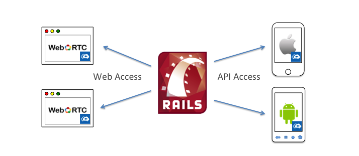

SightCall Communicator
======================

SightCall Communicator is a demonstration web-site that can be easily deployed to Heroku or your own servers.  Communicator demonstrates three real-time functions with a small roster of users.  The functions are:

- one-to-one video and voice
- multipary video-teleconference
- text-chat

SightCall Communicator has been created using common web technologies
(Rails, Bootstrap, jQuery), and is purposely kept small.  Not only is
it a showcase of SightCall technologies, it is a tutorial of
best-practices and idioms to use when embedding SightCall features
into your own site.

## Run It On Heroku

You can run your own instance of SightCall Communicator on Heroku in
just a few minutes.

- Clone this repository so you can customize it.
- If you have not already, you must request an API KEY from SightCall.  [http://www.sightcall.com/developers/](http://www.sightcall.com/developers/)
- Put the files `client.p12` and `authCA.crt` in the `certs` directory.  Check them in.

- Unpack your `client.p12` file into its two components  (see instructions in [Ruby](https://github.com/weemo/Server-SDKs/tree/master/Ruby)).

    - `privateKey.pem`
    - `publicCert.pem`

- Check these two files into the `/certs` directory.

- Create a new Heroku project for this demo.

```sh
    % heroku create
```

Note the URL of the project you just created.

- Push the code to Heroku

```sh
    % git push heroku master
```

- Run the `bootstrap` task (lib/rake/bootstrap.rb).  This creates the database and the default users.

```sh
    % heroku run bundle exec rake bootstrap
```

- Set the following Heroku environment variables.

```sh
    % heroku config:set RTCC_APP_ID=q7w4fktzzuf7
    % heroku config:set RTCC_AUTH_URL=https://auth.rtccloud.net/auth/
    % heroku config:set RTCC_CACERT=certs/authCA.crt
    % heroku config:set RTCC_CERTPASSWORD=XnyexbUF
    % heroku config:set RTCC_CLIENTCERT=certs/publicCert.pem
    % heroku config:set RTCC_CLIENTCERT_KEY=certs/privateKey.pem
    % heroku config:set RTCC_CLIENT_ID=e43cfcda02f45b39d347509d509817
    % heroku config:set RTCC_CLIENT_SECRET=6011b6d3a2d64d77fb4086b44996bf
    % heroku config:set CLOUDRECORDER_TOKEN=7e59b98c27331b82ef0e8fa9bfe37fcb
```

- Edit the `app.json` file and fix the following:
    - make sure the `repository` URL points to your clone of this repository
    - edit the
    
- Press the 'Deploy To Heroku' button
- 


Tutorial: Build a Rails App with Weemo
================================================================

<p><a href="https://heroku.com/deploy?template=https://github.com/sightcall/communicator_test"></a></p>


This repository hosts an example Rails project that illustrates how to
use Weemo to make and receive video calls within a web browser using
WebRTC.  You can simply check-out and run the example as is, but we
suggest using it as a reference as you follow the series of tutorials.
If you follow the steps of the tutorials, you should have a working
Rails site that is the same as the one checked in here.  In the
tutorials, we'll give you some tests to run along the way to make sure
the project is working.  However, if you follow the tutorial and get
stuck, the reference code here can be used to get you back on track.


In addition to using WebRTC in a browser, we are going to extend our
Rails application with an API for use by mobile clients.  The later
chapters in the tutorial describe how to build small Weemo video call
apps using this API.  When done, you will be able to make and receive
video calls between WebRTC enabled browsers, and native apps on IOS
and Android.
    
## Prerequisites

You should have Rails4 installed and you will need a text editor.

You should also have requested a Weemo API Key.  If you have not
already, you should visit here:
http://www.weemo.com/get-started-video-platform/.

## Table Of Contents

#### [Part 1: Build a little Rails App with Login and Logout](doc/HOWTO-part1.md)

In [Part 1](doc/HOWTO-part1.md) we show you how to build an extremely
simple Rails app with log in and log out functionality.  The web site
has only one main page, and implements a simple log in and log out
mechanism.

The purpose of Part 1 is to provide a website framework in which to
embed Weemo functionality.  The Weemo platform relies-on and requires
notions of identity and authentication.  This little Rails framework
has just enough to provide a small database of users, each of whom can
log in and log out.


#### [Part 2: Integrate the Weemo Auth Client](doc/HOWTO-part2.md)

In [Part 2](doc/HOWTO-part2.md) we integrate the Ruby authentication
client from Weemo into our Rails server.  Weemo provides Server-SDK
components here: https://github.com/weemo/Server-SDKs.

The purpose of Part 2 is to show how an authenticated user on a web
site may be granted a token to use Weemo video services.


#### [Part 3: Weemo Javascript and Video Calls](doc/HOWTO-part3.md)

In [Part 3](doc/HOWTO-part3.md) we include the Weemo Javascript on the
video-call page of our web site.  We show how to construct the
Javascript to initiate video calls, and we also show how to present a
pop-up to answer an incoming call.

At the end of Part 3, you will have a working web site in which
different users can log in and create video calls by clicking a button!

#### [Part 4: Adding an API](doc/HOWTO-part4.md)

In [Part 4](doc/HOWTO-part4.md) we extend the Rails application to
provide an API interface for mobile clients.  Mobile applications
written for iOS and Android that use the Weemo SDK can use these APIs
to connect to the Rails "mobile back-end" to get a token and to get
a list of friends to call


#### Part 5: A Simple IOS App

(*TO DO*)

In Part 5, we'll show how to write a very simple IOS App that can log
in as one of the users in the database and can call one of the other
users in the database.  The other user can be logged in on the Web
site or on another IOS device.


#### Part 6: A Simple Android App

(*TO DO*)

In Part 6, we'll show how to write a very simple Android App that can
log in as one of the users in the database and can call one of the
other users in the database.  The other user can be logged in on the
Web site, on an IOS device, or on another Android device.


