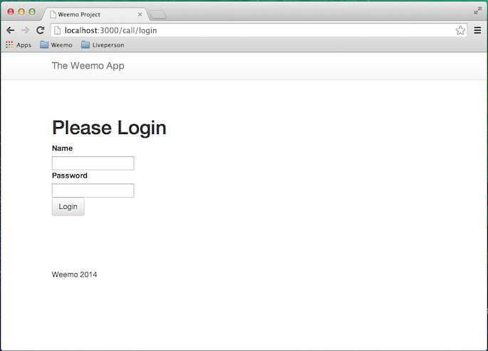
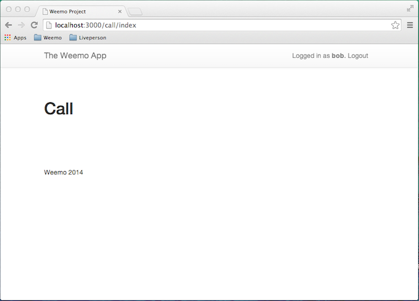

Build a little Rails App with Login and Logout
================================================================

We are going to illustrate how to build a tiny little Rails app that
allows users to log in and log out. The app will have a single 'index'
page that a logged-in user can view.

We will take a couple of shortcuts to keep the project small and
minimize dependencies.  Our User model will be minimal consisting only
of a username and a hashed password, and we will populate the User
table using the Rails console.  We will develop an extremely simple
login mechanism for the web interface using session storage.

At the end of this "Part 1" of the tutorial series we will have a tiny
website that provides the notions of *identity* and *authentication*.
Our website will have three users ("bob", "sue" and "tim") who can log
in and log out.  In following parts of this series, we will add Weemo
authentication and allow users to create video calls to each other by
name.


Create a new project
----------------

Create a new Rails project by issuing the following command.

```shell
$ rails new proj
```

This will create a lot of files in a new directory called ```proj```.
For the rest of this tutorial we will be working in this directory, so
you should change your working directory to that.

```shell
$ cd proj
```

If you list the files in this new project, you'll see something like
this.

```shell
$ ls
Gemfile      README.rdoc  app          config       db           log          test         vendor
Gemfile.lock Rakefile     bin          config.ru    lib          public       tmp
```

Create the User model
----------------

Our website needs to have login and logout, so we need a table of Users.  Use the Rails generate command to create a User table with three fields:

- name
- hashed_password
- salt

The name field will, of course, be the name of our user.  Rather than
storing the password of a User in cleartext, we will be a little more
secure and only store a hashed version of the password.  And to be
more secure, we will add some randomness into the hashed value by
using a 'salt'.  Create the table this way.

```shell
$ bin/rails generate model User name:string hashed_password:string salt:string
```

You will see that Rails creates a number of files for you.

```
      create    db/migrate/20140809122523_create_users.rb
      create    app/models/user.rb
      create      test/models/user_test.rb
      create      test/fixtures/users.yml
```

The migration creates the User table in the database with two fields.
Open it up and take a look.  We do not have to add any code to what
Rails created for us.

```ruby
# db/migrate/20140809122523_create_users.rb
class CreateUsers < ActiveRecord::Migration
  def change
    create_table :users do |t|
      t.string :name
      t.string :hashed_password
      t.string :salt

      t.timestamps
    end
  end
end
```

At this point, the migration defines *how* to build the table, but the
table has not yet been built.  To do that, you need to use the `rake`
command to run the pending database migrations.  (We have one
migration at this point.)

```shell
$ rake db:migrate
==  CreateUsers: migrating ====================================================
-- create_table(:users)
   -> 0.0058s
==  CreateUsers: migrated (0.0059s) ===========================================
```

Now we have a User table in the database.  Next we will add some behavior to the ActiveRecord model of a User.


Define the User model
----------------

An ActiveRecord model is a class whose instances are persisted in a
database.  By default, a model has 'getters' and 'setters' for the
fields of the database table.  The class defining a model can add
behaviors to a model to abstract the fields.  We'll take advantage of
this feature to simplify the way passwords are hashed and saved.

Create a simple User model that looks like this.

```ruby
# app/models/user.rb
class User < ActiveRecord::Base

  # Make :password a virtual attribute of the database
  attr_accessor :password

  def password
    @password
  end

  def password=(pwd)
    @password = pwd
    return if pwd.blank?
    create_new_salt
    self.hashed_password = User.encrypted_password(self.password, self.salt)
  end

  # Every time we update the password, generate a new salt
  def create_new_salt
    self.salt = self.object_id.to_s + rand.to_s
  end

  # The encryption scheme uses the salt
  def self.encrypted_password(password, salt)
    h = password + "weemo" + salt
    Digest::SHA1.hexdigest(h)
  end

  # Our authentication scheme returns the user
  def self.authenticate(name, password)
    user = self.find_by_name(name)
    if user
      if user.hashed_password != encrypted_password(password, user.salt)
        user = nil
      end
    end
    user
  end
    
end
```

The `attr_accessor` declaration defines a getter and setter for the
virtual attribute `password`.  By default, getters and setters set
instance variables.  In the lines below we modify the default
behavior.  The getter returns the `@password` instance variable, as
default.  However, the setter for the virtual field actually hashes
the password and stores it in the `hashed_password` field of the
database.

Every time we store a new password, we create a new pseudo-random
value to mix into the hash.  This value is called a 'salt', and using
it makes it hard for an attacker to figure out your password even if
they get access to the hashed value.  (This technique and code was
borrowed from the excellent book:
[Agile Web Development with Rails](http://www.amazon.com/Agile-Development-With-Rails-Edition/dp/0935718850/ref=sr_1_21?ie=UTF8&qid=1407780186&sr=8-21&keywords=rails3+book).)

When we store new users in the database, we'll be able to specify a
password and Rails will store the hashed version.

The last method in the model is the `authenticate` method.  This is a
class method (the reference to `self` in `self.authenticate` is the
class).  This method looks up the current user by name using the
method `find_by_name`.  We have not actually defined this method on
the User model, but Rails has!  Rails will notice that this method is
not defined but that it starts with `find_by` and ends with the name
of a column in the database.  Rails constructs the finder method on
the fly and executes it.

If a user is found, the hashed version of the password is compared to
the stored hashed version.  If they match, the user is authenticated.


Populate the Database
----------------

We are now going to populate the User table with a couple of users by
using the Rails console.  The Rails console is a Ruby interpreter that
has the entire Rails environment of your project loaded.  It is a
convenient way to examine and manipulate the data structures of the
project.

Open up the console and define three Users as shown below.  Notice the
`save` method: this causes each user to be saved to the database.

```shell
$ bin/rails console
> User.new(:name => "bob", :password => "bobpassword").save
> User.new(:name => "sue", :password => "suepassword").save
> User.new(:name => "tim", :password => "timpassword").save
```

Take a quick look at the contents of the database using the "all"
query on the User table.  You will see something like the following.

```
> User.all
User Load (0.2ms)  SELECT "users".* FROM "users"
=> #<ActiveRecord::Relation
[#<User id: 1, name: "bob", hashed_password: "683d1a54afb7f86cc3ba0a8d7d748af788a5d963",
        salt: "702119719325000.9015578791526967", created_at: "2014-08-11 17:54:11", updated_at: "2014-08-11 17:54:11">,
#<User id: 2, name: "sue", hashed_password: "538b5c327172bb5b26b05a7b3f1b8fbe6a064e42",
        salt: "702119712333400.3684953803860209", created_at: "2014-08-11 17:55:03", updated_at: "2014-08-11 17:55:03">,
#<User id: 3, name: "tim", hashed_password: "3e9e8353f7711b915247ec114c9f9a48cdc26338",
        salt: "702119711334000.4091396350618324", created_at: "2014-08-11 17:55:16", updated_at: "2014-08-11 17:55:16">]
    >
```

The first line from the logger echoes the SQL statement executed to
query the table.  The output of the interpreter follows the `=>`
symbol.  We see a list of three Users and notice our users' names and
their hashed passwords.  So far, so good!


User Authentication
----------------

For our tiny web site, we will protect the pages of the site with an
authorize method.  This method checks the current session to see if it
contains a `user_id` parameter.  If it does not, or it does not match
a user, then we redirect the user to the login page.

We also define two helper methods for determining the current user and
checking if a user is signed in.  

```ruby
# app/controllers/application_controller.rb
class ApplicationController < ActionController::Base
  # Prevent CSRF attacks by raising an exception.
  # For APIs, you may want to use :null_session instead.
  protect_from_forgery with: :exception

  before_filter :authorize, :except => :login
  helper_method :current_user, :user_signed_in?

  def authorize
    unless User.find_by_id(session[:user_id])
      flash[:notice] = "Please log in"
      redirect_to :controller => 'call', :action => 'login'
    end
  end

  def current_user
    @current_user ||= User.find_by_id(session[:user_id])
  end

  def user_signed_in?
    current_user != nil
  end

end

```


### A Call controller

Now we will define a single controller for this project.  The
controller will have one main index page, and two helper pages for
login and logout.  Define the controller using a rails generator.

```shell
$ bin/rails generate controller call login logout index
```

This command will generate a lot of files.  The ones we are interested
in are the `call_controller.rb` and the views: `login.html.erb`,
`logout.html.erb` and `index.html.erb`.  Open up the `call_controller.rb`
file and fill in the login and logout methods.

```ruby
# app/controllers/call_controller.rb
class CallController < ApplicationController
  def login

    if request.post?
      user = User.authenticate(params[:name], params[:password])
      if user
        flash.now[:notice] = "Successful login"
        session[:user_name] = user.name
        redirect_to(:action => "index")
      else
        flash.now[:alert] = "Invalid user/password combination"
      end
    end

  end

  def logout
    session[:user_name] = nil
    flash[:notice] = "Logged out"
    redirect_to(:action => "login")
  end

  def index
  end
end
```

The login method will be called in two contexts: with a GET and a
POST.  In the GET method, it will be called to render a login page.
We will get to this next.

If the login request is a POST, then it is receiving login
parameters.  We see if the name and password fields authenticate the
user, and if so we flash a notice and redirect to the index page.  We
also store the name of the user in session storage.

When we generated the controller, rails added routes to the
config/routes.rb file.  However, it did not create one for the POST of
the login method.   Edit this file and add the route.  While you are
at it, also add the route for "home" so that top-level queries go to the
Call page.

```ruby
# config/routes.rb
  get "home" => "call/index"

get "call/login"
  post "call/login"
  get "call/logout"
  get "call/index"
```


The logout method is called when the user visits the logout page.
Here the session storage will be cleared of the current user and a
flash will be recorded saying the user is logged out.

Now, edit the `login.html.erb` file.  We must create a page that
welcomes the user and a form that obtains the name and password
parameters.

```html
# app/views/call/login.html.erb
<h1>Please Login</h1>

<div>
  <%= form_tag do %>
    
    <div>
      <label for="name">Name</label><br>
      <%= text_field_tag :name, params[:name] %>
    </div>

    <div>
      <label for="password">Password</label><br>
      <%= password_field_tag :password, params[:password] %>
    </div>

    <div>
      <%= submit_tag "Login", :class => "btn btn-default" %>
    </div>

  <% end %>
</div>

```

At this point, we have a login page and an index that doesn't do
anything.  Let's make it a little more attractive and give our pages a
navigation header.

## Style the template

Open up the `application.html.erb` file in `app/views/layout`.  This is the
main template for the site.  We will use Twitter Bootstrap to give our
little site some modern flavor.  You can download bootstrap from here:
http://getbootstrap.com/2.3.2/.  But there is also a Bootstrap CDN that
serves the files directly (maxcdn.bootstrap.cdn.com) so we'll use that
to make our life easier.

Add the following two stylesheet links in the head section right after
the title.

```html
<link rel="stylesheet" href="//maxcdn.bootstrapcdn.com/bootstrap/3.2.0/css/bootstrap.min.css" />
<link rel="stylesheet" href="//maxcdn.bootstrapcdn.com/bootstrap/3.2.0/css/bootstrap-theme.min.css" />
```

Load the bootstrap javascript at the end of the page.  Just before
the ```</body>``` tag put the following line.

```html
<script src="//maxcdn.bootstrapcdn.com/bootstrap/3.2.0/js/bootstrap.min.js"></script>
```

#### Define the navigation area

Just copy and paste this code into the template at the top of the
body.  This defines the navigation area and shows the current user.
(We defined the `current_user` method earlier.)  It also links to the
logout page.

```html

  <nav class="navbar navbar-default navbar-fixed-top" role="navigation">
    <div class="container">
      <div class="navbar-header">
        <button type="button" class="navbar-toggle" data-toggle="collapse" data-target=".navbar-collapse">
          <span class="sr-only">Toggle navigation</span>
          <span class="icon-bar"></span>
          <span class="icon-bar"></span>
          <span class="icon-bar"></span>
        </button>
        <a class="navbar-brand" href="/">The Weemo App</a>
      </div>
      <div class="collapse navbar-collapse">

        <p class="navbar-text pull-right">
          <% if user_signed_in? %>
            Logged in as <strong><%= current_user.name %></strong>.
            <%= link_to "Logout", '/call/logout', :class => 'navbar-link'  %>
          <% else %>
            
          <% end %>
        </p>

      </div>
    </div>
  </nav>

```


#### Style the Flash

In our default template, there is no place for the flash message to
render.  Replace the ```<%= yield %>``` with the following block.

```html

  <div class="container">
    <% if notice %>
      <p class="alert alert-success"><%= notice %></p>
    <% end %>
    <% if alert %>
      <p class="alert alert-danger"><%= alert %></p>
    <% end %>

    <%= yield %>
  </div>
```

The `yield` is where the content of our page is rendered.

#### Add a footer

Below the body, add a footer.

```html
<footer>
  <div class="container">
    My Project
  </div>
</footer>
```


#### Modify application.css

The navigation area and the footer need some room.  Modify the main
`application.css` as shown.  We are also adding the CSS that helps
style the error messages Rails presents.  These last two will make our
application more attractive.

```css
/* app/assets/stylesheets/application.css */

body { padding-top: 100px; }
footer { margin-top: 100px; }
table, td, th { vertical-align: middle; border: none; }
th { border-bottom: 1px solid #DDD; }

/*
 * style error messages re: bootstrap
 * http://stackoverflow.com/questions/15155890/styling-form-error-message-bootstrap-rails
 */

#error_explanation {
  color: #f00;
  ul {
    list-style: none;
    margin: 0 0 18px 0;
  }
}

.field_with_errors {
  @extend .control-group;
  @extend .error;
 }
```

## Disable Turbolinks

We are going to remove Turbolinks from our Rails site.
Remove the attributes from the stylesheet_link_tag and the
javascript_include_tag in the tempate.  Change it from this

```
# app/views/layout/application.html.erb

<%= stylesheet_link_tag    "application", media: "all", "data-turbolinks-track" => true %>
<%= javascript_include_tag "application", "data-turbolinks-track" => true %>
```

to this.

```
# app/views/layout/application.html.erb

<%= stylesheet_link_tag "application", media: "all" %>
<%= javascript_include_tag "application" %>
```

Remove the turbolinks gem in the Gemfile, or comment it out.  Then run
"bundle".

```
# Gemfile

# Turbolinks makes following links in your web application faster. Read more: https://github.com/rails/turbolinks
# gem 'turbolinks'
```

Lastly, remove the line "//= require turblinks" from app/assets/javascripts/application.js.

*Rationale*: Rails4 includes (by default) a gem call Turbolinks.
Turbolinks makes your web site appear faster when a visitor returns to
a page that has already been visited.  Using Turbolinks effectively
takes care ... especially in the context of how Javascript is used.
All of this is beyond the scope of what we want to do in these
tutorials, so we have removed it.


## Test the site

At this point, you should be able to run this website locally and
visit it at [http://localhost:3000/](http://localhost:3000/).

```shell
$ bin/rails server
```

You should be directed to the Login page like this.



You should be able to login as 'bob', 'sue' or 'tim' using the
passwords you set.  If you successfully log in, you should go to the
empty index page.  You should be able to log out.



If all of this is working, congratulations!  Now we can move on to the
fun stuff.


## What we learned

In this tutorial, we learned how to create a new Rails web site.  We
defined a User model that stored a name and hashed password, and we
populated our database with a list of three users.  We developed login
and logout methods, and we styled the page a little bit using
Bootstrap.


<hr>

[ Continue to [Part 2](HOWTO-part2.md) ]
